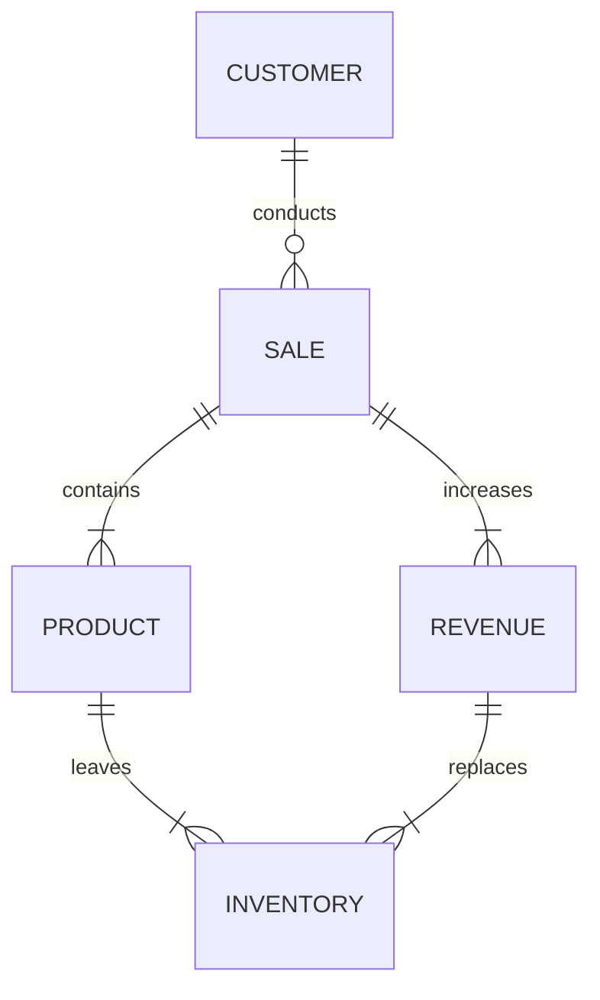

# Explanation
### Customer to Sale
The customers buy products and pays the money to the company through sales.
### Sale to Product
The sale indicates a sale of product.
### Sale to Revenue
A sale will also bring in cash flow that is categorized as revenue.
### Product to Inventory
When a product is sold, that product will 'leave the shelves' or the product will leave the inventory.
### Revenue to Inventory
The revenue made from the sale of the product can be used to replace the product in the inventory.
